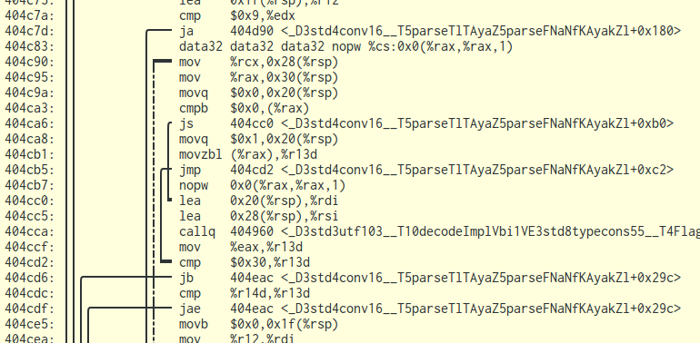

# disasm

A more beautiful disassembler than `objdump -D`.
Ok, it is a wrapper, but it makes objdump more useful to me.

To build run `dub build`.

## Example

The position and instructions are verbatim from objdump.

Backjumps (upwards) are dashed,
so their vertical lines can be easily distinguished from forward jumps.
The horizontal line is bolder at the jump target
to visualize start and end of a jump.
